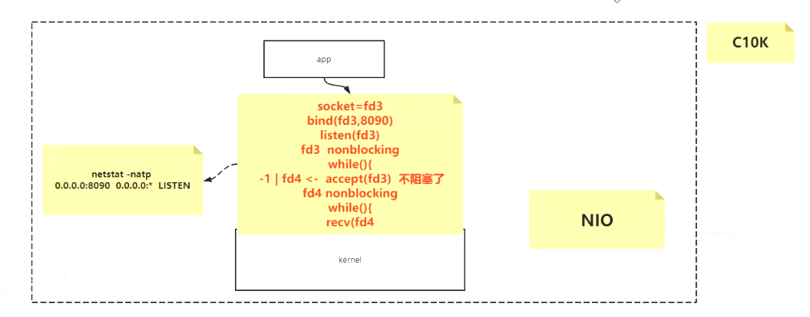

# IO精讲

## 01虚拟文件系统，文件描述符，IO重定向

本章节主要是对linux 的一些命令以及功能进行简单讲解。

FD：文件描述符 0:输入  1：标准输出  2： 异常输出

什么是FD：每一个进程访问磁盘的时候，都会经过内核控制的pagecache, 文件描述符记录这pagecache的位置以及偏移量

pagecache： 内核管理的缓存，一个页大小是4K，程序读取或者操作的时候，通过系统调用内核，内核操作pagecache ， 然后pagecache变为脏页， 可以通过flush把数据刷回磁盘；

echo 打印

head/tail -n  从头/从尾 打印n行

$$ : 当前进程号

lsof -op $$ ：打印当前进程的文件描述符的细节,包括偏移量、指针等等

| ： 管道，左边输入 右边输出，分别是不同的进程

重定向： '<:  输入    '>': 输出

cat: 查看文件内容

中断的概念： 提醒一下cpu ，该程序可以执行了。

DMA：协处理器

## 02内核中PageCache、mmap的作用

pagecache: 在app调用磁盘的时候，内核会进行缓存pagecache，可以通过配置缓存全部的磁盘，或者说当内存到达某个阈值的时候，会进行pagecache淘汰策略。pagecache的实质，就是减少磁盘IO。

### 普通IO：

每次读写，都会进行一次系统调用，速度慢。

### BufferIO：

减少系统调用，在JVM默认缓冲8k，如果满了会调用一次系统调用

### ByteBuffer：

- HeadByteBuffer ： JVM堆内内存：可以进行垃圾回收
- DirectByteBuffer：JVM 堆外内存： 没有JVM管理，可能会内存泄漏
- MappedByteBuffer： 使用fileChannel.map 获取mmap

### Mmap：

允许直接将文件映射到进程内存，可以通过操作mmap，操作pagecache，直接进行磁盘IO，不需要经过系统调用。

JavaNIO包下的**MappedByteBuffer**类就可以实现「mmap」，他是**DirectByteBuffer** 的变种。

## 03 Socket编程BIO以及TCP

网络IO的基础知识，

客户端进行连接服务端，会先在内核进行申请资源，等于是先在内核里面先连接上了，然后申请buffer。

### socket

可以简单理解为一个四元组(客户端ip，客户端port，服务端ip，服务端port)

在每一个连接里面都是唯一的。每一个连接，客户端和服务端都会有单独的一个fd 文件描述符进行描述。

### bio

客户端有连接请求之后，服务端就需要启动一个线程进行处理。如果连接没有做事情，这个线程也会一直启动着，造成不必要的开销。

### tcp

面向连接的，可靠的，基于字节流的传输层通信协议，目的在于建立客户端与服务器之间的可靠连接，三次握手连接, 四次挥手断开连接。

#### 3次握手：

#### 4次挥手：

这个四次挥手，服务端主动断开和客户端断开同理，都需要走四次分手的过程；

TIME_WAIT:目的是为了客户端发出ack 断开请求之后，服务端可能不会接收到，服务端会重新发送FIN包，然后客户端再接收， RFC 793中规定MSL为2分钟，实际应用中常用的是30秒，1分钟和2分钟等。

#### 滑动窗口：

窗口滑动协议是TCP使用的一种流量控制方法。该协议允许发送方在停止并等待接收确认报文前可以连续发送多个分组。由于发送方不必每发
一个分组就停下来等待确认，因此该协议可以加速数据的传输。只有在接收窗口向前滑动时（与此同时也发送了确认），发送窗口才有可能向前滑
动。收发两端的窗口按照以上规律不断地向前滑动，因此这种协议又称为滑动窗口协议。

### 网络IO 变化 模型

同步 异步 

阻塞 非阻塞

strace -ff -o out cmd: 追踪系统调用

#### BIO

可以看出，服务端启动的时候，是做了系统调用

给socket 分配fd ，绑定 fd 和端口，监听，然后等待客户端连接

客户端连接上之后，分配新的fd ， 然后继续等待客户端连接。

服务端接收一个连接的时候，就会开辟一个新线程，阻塞IO。

#### NIO

非阻塞IO。

不需要开辟新线程。

和bio 一样，建立socket连接，定义fd，fd绑定端口，监听fd

但是，要设置为非阻塞，nonblocking ， 

当accept(fd) 时，不会阻塞， 里面可能接收到连接上的文件描述fd

或者是-1； 

然后再通过循环 读取 socketChannal 里的数据。读取的时候，如果>0 则代表有数据。

#### 多路复用器

使用多路复用器一次查看所有io的状态。可以避免过多的资源浪费。

**基于同步模型下：**

多路复用器 种类：

#### select

#### poll

poll 是 select 的升级版，没有限制fd的数量。

无论是nio ， select ， poll ，都会去循环获取所有的 io状态，

#### epoll

##### 中断

中断的概念： 提醒CPU 可以执行新的程序。中断会产生回调

##### epoll 原理

app 调用 epoll_create 会创建一个红黑树，存放fd 

调用epoll_ctl 可以对红黑树进行添加删除操作，

epoll_wait，调用链表返回，链表里的都是有数据操作的fd

##### epoll 和 select 的比较

#### 同步、异步、阻塞、非阻塞

同步：app 需要自己进行 R/W ，例如 app 调用 read 进行获取数据，

## 复盘

文件描述符 以及 文件IO

linux认为一切皆文件，可以用fd 文件描述符 代表 socket连接，输入 ，输出，等

文件IO ， app 系统调用read ， 内核会开辟出一个pagecache ，用来映射硬盘里的数据，每一个pagecache是4k，pagecache 可以被立马刷写，也可以按时刷写，不过断电会丢失数据，同一个文件在被不同进程读取的时候，是共享pagecache的。pagecache 如果被修改数据，则会被标记为脏页，需要同步刷回磁盘.

流和buffer 

流每次写入pagecache，都会产生内核级别的调用，修改pagecache，

但是buffer 则会积攒到一定数量，才会进行读写操作，减少了系统调用

socket  bio  nio 多路复用器

服务器socket 会定义一个fd 来进行描述 监听的端口，如果客户端连入进来，则会产生一个新的fd 来代表这个连接，socket 可以简单认为是一个四元组

客户端ip，客户端port，服务端ip，服务端port

bio ， 则是监听的端口是否有连接连入的时候，会产生阻塞，以及如果读取数据的时候，没有数据，也会阻塞住，所以一个连接，需要新建一个线程。

nio，监听端口的时候，如果没有连接连入，也不会堵塞住，只会返回-1.

读取数据的时候如果没有数据，也是返回-1 ，不会堵塞住，但是有个很大的问题，读取数据，会循环每个fd ，进行系统调用，内核查看是否有无数据传输，造成严重浪费fd性能；

多路复用器： select poll  epoll

select 和 poll  ，在查看所有fd是否有无传输数据的时候，只会调用一次系统调用，内核会循环获取这些fd ， 然后返回这些fd的状态，再进行接收数据

epoll ，则是创建连接的时候，就会再内核中开辟一个红黑树，以及链表，

当有连接加入的时候，就会调用接口，将fd加入这个红黑树，当客户端进行传输数据的时候，网卡会将buffer 进行传输给内核中的fd缓冲区，然后就会把红黑树的这个fd加入链表，代表这个fd是有数据传输的，这样就不需要循环了，

app调用epoll_wait 的时候，直接返回链表即可。

mmap： 在进程的内存中开辟一块不属于jvm内存的映射区域，会直接映射到pagecache中，可以直接修改pagecache ， 不会产生系统调用，不会进行用户态和内核态的切换。但是依旧遵守pagecache的规则。

