# Redis 

## 简介

Redis 是一个开源（BSD许可）的，内存中的数据结构存储系统，它可以用作数据库、缓存和消息中间件。 它支持多种类型的数据结构，如 [字符串（strings）](http://redis.cn/topics/data-types-intro.html#strings)， [散列（hashes）](http://redis.cn/topics/data-types-intro.html#hashes)， [列表（lists）](http://redis.cn/topics/data-types-intro.html#lists)， [集合（sets）](http://redis.cn/topics/data-types-intro.html#sets)， [有序集合（sorted sets）](http://redis.cn/topics/data-types-intro.html#sorted-sets) 与范围查询， [bitmaps](http://redis.cn/topics/data-types-intro.html#bitmaps)， [hyperloglogs](http://redis.cn/topics/data-types-intro.html#hyperloglogs) 和 [地理空间（geospatial）](http://redis.cn/commands/geoadd.html) 索引半径查询。 Redis 内置了 [复制（replication）](http://redis.cn/topics/replication.html)，[LUA脚本（Lua scripting）](http://redis.cn/commands/eval.html)， [LRU驱动事件（LRU eviction）](http://redis.cn/topics/lru-cache.html)，[事务（transactions）](http://redis.cn/topics/transactions.html) 和不同级别的 [磁盘持久化（persistence）](http://redis.cn/topics/persistence.html)， 并通过 [Redis哨兵（Sentinel）](http://redis.cn/topics/sentinel.html)和自动 [分区（Cluster）](http://redis.cn/topics/cluster-tutorial.html)提供高可用性（high availability）。

## redis 与 memcache的比较

redis 和 memcache 都是存的key - value ，

但是memcache 的value 没有数据类型的概念，所以如果存入一个json ，json 里是数组，拿去取出数组中一个下标的时候，就需要全部取出json，再做操作，会对磁盘IO造成性能损耗，而redis 中，value有存储lists 的功能，提供方法可以直接取。

## redis 的基本数据类型

help @+数据类型 可以查看帮助文档

#### string(字符，数值，bitmap)

set key value [expiration EX seconds|PX milliseconds] [NX|XX]

```
例如：
//nx 当key 不存在的时候才可以设置
//可以当成锁
set k1 xx nx

//xx 只能更新，key 已经存在了，才可以设置
set k2 xxxxx xx
get k2 (nil)
```

mset : multi set

mget

getrange key start end(截取值得部分字符)

setrange key offset value

```
正向索引 0 1 2 3
逆向索引 -3 -2 -1
set k1 "hello world" 
getrange k1 6 -1 (world)
setrange k1 6 "aaaa"
get k1 (hello aaaa)
```

STRLEN key (字符串长度)

append 

type （查看key 所对应的value 是什么类型）

OBJECT encoding key（ 返回给定 `key` 锁储存的值所使用的内部表示）

redis 是二进制安全的，按字节流存储

GETSET (获取老值并设置值新值)

MSETNX 多笔设置，如果其中有一个存在，则全部失败，原子性操作

##### 数值

INCR key （数值自增）

INCR key increment (数值加几)

DECR key

DECR key decrement

##### bitmap

setbit  

bitcount 

```
setbit key1 1 1 (0000 0001)
setbit key1 1 1 (0100 0001)
get key1 ('A')
bitcount key (2)

```

bitpos (检测下标)

```
bitpos命令：
语法：bittops key bit [start] [end]
返回位图中第一个值为bit的二进制位的位置
在默认情况下,命令将检测到的整个位图,但用户也可以通过可选的start参数和end参数指定要检测的范围

setbit m  3 1
bitpos m 0   返回0
bitpos m 1   返回3
```

bittop

```
bitop命令：
语法：bitop operation destkey key [key...]
对一个或多个保存二进制位的字符串key进行位元操作,并将结果保存到destksy上

operation可以是AND、OR、NOT、XOR这四种操作中的任意一种：
bitop and destkey key [key...]对一个或者多个key求逻辑并，并将结果保存到destkey

bitop or destkey key [key...]对一个或者多个key求逻辑或，并将结果保存到destkey

bitop xor destkey key [key...]对一个或者多个key求逻辑异或，并将结果保存到destkey

bitop not destkey key [key...]对给定key求逻辑菲，并将结果保存到destkey
```


##### bitmap 的需求用处

1. 有用户系统，统计用户登录天数

```
可以使用二进制存储用户是否登录，如果登录则置为1.
例如，用户第二天登录了，则
set user1 1 1
用户第8天登录了
set user1 7 1
用户第365天登录了
set user1 365 1

这时候如果要查询某个区间是否登录，则
BITCOUNT user1 (查总共登录多少天)
BITCOUNT user1 start end（查区间）
```

2. 统计活跃用户

```
如果统计京东某时期的活跃用户（几天内有过一次登录的都算活跃用户）
可以使用日期作为key,
例如：登录用户的id 为1
setbit 20210307 1 1
setbit 20210306 1 1
setbit 20210307 7 1
bittop or destkey 20210307 20210306
或运算,去重

然后计算活跃用户：
bitcount destkey 0 -1 
```

#### List（双向链表）

lpush (从左边添加元素)

rpush(从右边添加元素)

lpop (从左边添加弹出元素)

rpop(从左边添加弹出元素)

同向命令操作与栈相似

- 例如，lpush key1 a              lpop

反向命令就是队列

- 例如，lpush key1 a             rpop

LRANGE (从左到右打印出List里的元素)

LINDEX （取出下标元素）

LSET （设置下标为X的值）

LREM （移出某元素）

LINSERT （插入元素）

blpop (阻塞弹出元素)阻塞，单播队列，FIFO

LTRIM 删除两端的元素

#### hash

hset （可以理解为map 里面存着一个map）

hget

hkeys

hvalues

hgetall (获取所有键值对)

hincrbyfloat key key1 value(value可以是负数)

- 应用场景：点赞，收藏等，

```
hset key1 (key value...)key-value 成对出现
hset key1 name rxt age 18
hget key1 name (rxt)
hget key1 age (18)
hget key1 name age (rxt 18)
hkeys key1(name age)
hvalue (rxt 18)
hgetall key

hincrbyfloat key1 age 0.5 
hget key1 age (18.5)
hincrbyfloat key1 age -1 
hget key1 age (17.5)
```

#### set

sadd key

smembers key

srem key

sinter key2 key1 (返回交集)

sinterstore dest key1 key2 （dest 是交集，直接存储在redis里）

SUNION （并集）

SUNIONSTORE

SDIFF key1 key2 (差集 key1 - key2)

srandmember key [count(正负数 0)]

- 如果count为正数，取出一个去重的结果集，不能超过已有集合
- 如果是负数，取出一个带重复的结果集，一定满足你要的数量
- 如果为0，不返回

SPOP 随机弹出一个数


#### sorted set

zadd 物理内存左小右大

zrange k1 0 -1

zrange k1 0 -1 withscores

zrangebyscore k1 1 2

zrevrange k1 0 1

zrank  key apple 排名

zscore key apple分值

zincrby key score apple

```
歌曲排行，排行榜
```

并集，交集，差集 更关注分数

ZUNIONSTORE destkey count key1 key2 weights weight1 weight2 

##### 排序是怎么实现的，增删改查的速度？

skip list 跳表

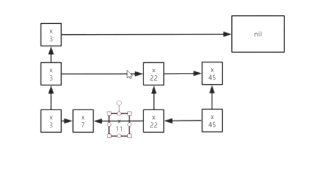


## redis的进阶使用

### 订阅消息

subscribe channel（监听）

publish  PUBLISH  message

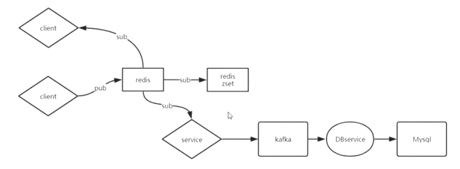


redis 作为发布者订阅者接受实时消息

redis 作为缓存，储存三天内的消息

kafka服务订阅redis，存储去mysql数据库，存储长期数据

### 事务

multi 开启事务

exec 提交事务

每个客户端都会开启一个队列，进行事务操作处理，哪个队列先exec提交事务，就会先把队列里的操作都执行完，

watch 监控key 是否改变，如果key发生改变，则事务不执行，

#### redis不支持事务回滚

只支持语法错误的事务回滚。

### 布隆过滤器

防止缓存穿透：例如淘宝搜索淘宝没有的东西，判断是否需要去数据库查询，如果没有，就不需要去数据库查询了。

如何用小的空间，存储大的匹配数据


假如系统中有大量的商品数据，搜索时，不可能直接查询数据库，这时候，可以把商品的关键字（名称或者id)根据某些映射元素映射到bitmap中，这样，所有的商品关键字就存在了redis中，当搜索时，同样使用映射函数查询映射的结果是否在bitmap中被标记了，如果被标记了，就说明很大的概率是由该商品的。

布隆过滤是概率解决问题的，不可能百分百的阻挡，会大量减少放行，而且成本低。

bloom 过滤器

counting bloom

cukcoo 过滤器

## redis作为数据库/缓存的区别

redis 缓存主要解决读请求

缓存数据不重要，不是全量数据，缓存应该随着访问变化，热数据。

redis 缓存里的数据怎么随着业务变化，只保留热数据？因为内存大小是有限的，是一个瓶颈。

redis 缓存的key 设置有效期，

redis 缓存 淘汰掉冷数据

redis 内存可以设置内存大小，一般1-10G

redis内存淘汰策略：

1. LRU 最近最少使用 （Least Recently Used）
2. LFU ,最不经常使用  (Least frequently used)

可以进入redis.cn 查看这些策略

## redis的expire

```
set key1 expire time
ttl key1
EXPIRE KEY time
EXPIREAT key timestamp
```

1. 过期时间不会随着访问延长时间
2. 发生写，会剔除过期时间
3. 倒计时EXPIRE，不能延长时间
4. 定时 EXPIREAT

何时删除过期的key

1. 被动访问时判定
2. 轮询判定，

## 缓存常见问题,面试回答思路

### 缓存击穿

redis 缓存 key过期了，然后直接高并发访问到了Mysql，造成了缓存击穿。

如何解决：

​	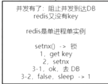

问题：1. 如果第一个请求数据库的挂了，

解决：可以设置锁的过期时间

问题2：第一个锁过期了，怎么办

设置一个多线程，一个线程读取DB，另一个线程监控数据是否读取回来，然后更新锁的时间。

### 缓存穿透

从业务接收的查询是你系统根本不存在的数据，

可以使用布隆过滤器进行过滤，

### 缓存雪崩

大量的key同时失效，间接造成大量的访问到达DB，

解决方案：随机过期时间

但是有个问题，如果必须零点过期，就得和缓存击穿累死的，使用锁，让第一个访问的访问DB，其他的阻塞等待。

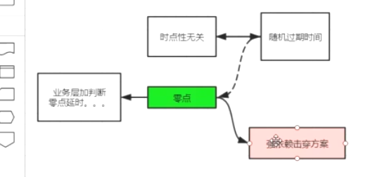

业务层使零点过期，延迟（例如十几秒）

### Redis 分布式锁如何做

简单的可以使用setnx来做，

建议使用zookeeper来做

### 一致性（双写）


## redis的持久化 

redis 在进行持久化的时候，可以fork 一个子进程，子进程和redis的主进程里的内容一致，指针指向相同的数据（不会造成内存浪费），如果主进程修改数据，会触发copyOnWrite 即写时复制，会在内存里写一份新数据，指针指向新数据，子进程的数据不会被修改。所以子进程保存的数据是触发fork时的数据.

### RDB 快照

配置文件中 save 900 1 代表900s内至少一次操作就会保存

bgsave fork创建子进程

缺点：

1. 不支持拉链，只有一个dump.rdb 需要定时复制dump.rdb
2. 丢失数据相对多

优点：恢复速度相对快

###  AOF 日志

redis 的写操作记录到文件中，丢失数据少

redis中，RDB 和 AOF 可以同时开启，但是如果开启了AOF，只会用AOF恢复，4.0 之后AOF中包含RDB全量，增加记录新的写操作。

缺点：

1. 体量无限变大，恢复速度慢

解决方法：

1. 4.0 之前，重写命令，删除抵消的命令，合并重复的命令
2. 4.0 以后，重写-》将老的数据RDB 到aof文件中，将增量以指令的方式Append到AOF，用到了RDB的恢复速度快和利用了日志的全量

#### IO

redis是内存数据库，写操作会触发IO，于是redis可以设置三种IO级别的写到AOF日志里：

```
appendonly yes
appendfilename “appendonly.aof”

//三种级别
appendfsync always //数据最可靠，每个操作都会同步
appendfsync everysec //每秒同步一次
appendfsync no //从不同步
```

## 集群

### 单机、单实例、压力

会出现什么问题？

1. 单点故障
2. 容量有限
3. 压力大

如何解决？


读写分离

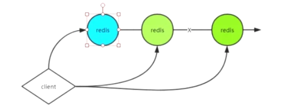

可以解决单点故障，部分压力，第一台支持增删改，其他的支持查


可以按照业务的划分，分成不同的redis

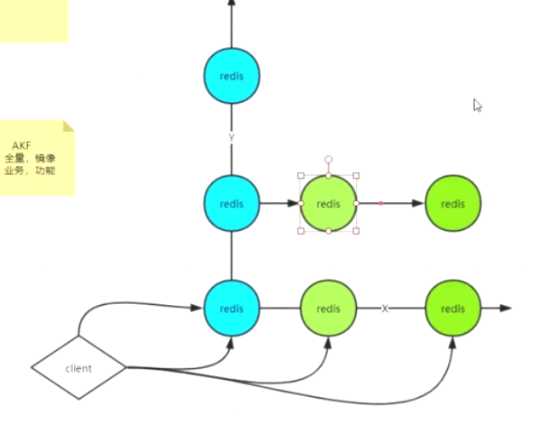


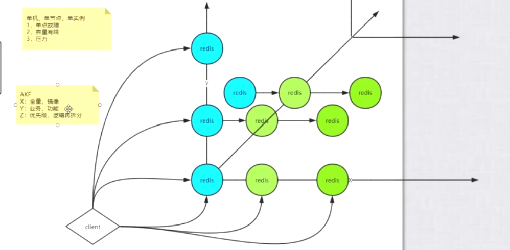


业务继续扩展，根据优先级，逻辑继续拆分

#### 

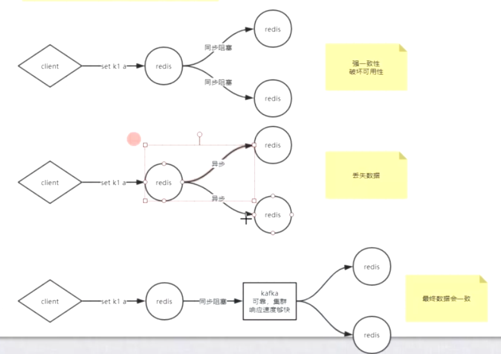


常用主从复制、

主备是对主库的备份，不会访问， 

主从是主节点一般读写操作，从节点读

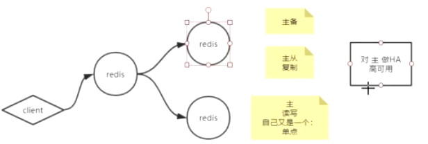


### redis 如何开启主从复制？

主从复制可以解决单点故障和压力大。

5.0 之后可以使用replicateof ip port 加入从节点 

redis 默认使用异步进行同步数据，所以数据不会高度一致

### redis 如何通过进行监控？选举master

使用redis 的 sentinel ，可以配置监控master ，sentinel可以看到所有节点和其他的sentnel，

如果发现主节点挂掉了，就会从配置设置的数量，判定是否master真的挂掉了，进而选举新的master

### redis 如何解决容量的问题？

1. 通过业务逻辑拆分，将数据拆分到不同的redis数据库里
2. 通过算法，hash + 取模，放到不同的数据库里，但是缺点很明显，就是取模的数必须固定，改变了，取值不一定能从数据库里取出来
3. random lpush ，随机存到redis里，主要用作消息队列，
4. kemata 一致性哈希，通过映射算法，例如hash，

也是hash + 取模，但是取模是取的2^32 吗，也就是最终会形成一个环形，适合当缓存，不适合当数据库

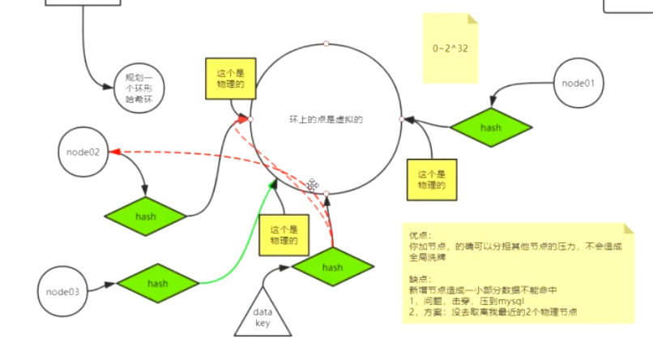

## CAP

C：Consistency 一致性

A：Availability 可用性

P：Partition tolerance 分区容错性

三者只能选其二


## 随笔

### IO知识

redis 是 单进程，单线程的，使用epoll进行处理请求，epoll 可以理解为，kernel（linux内核） 同步，非阻塞，多路复用。


升级过程：

操作系统将虚拟空间划分为两部分，一部分为内核空间，一部分为用户空间。

#### BIO

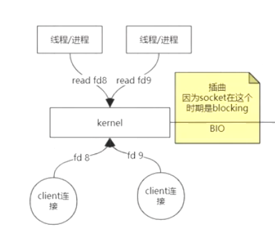


#### NIO

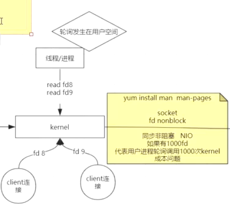


#### 多路复用NIO

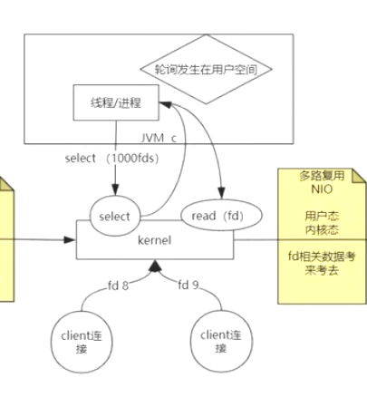

##### select（） ： 系统调用函数

select 筛选出 不是空文件的fds ，然后再传给用户空间进行read

##### epoll 

epoll 主要是用户空间和系统空间有了一个共享空间，底层是红黑树和链表，不需要进行拷贝，浪费系统资源。

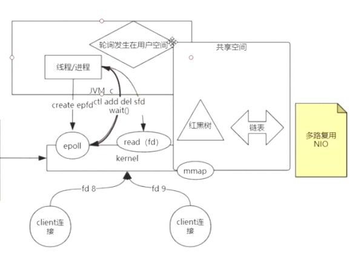

sendfile（in，out），sendfile系统函数，拥有输入和输出，不需要用户态在调用的时候拷贝，称之为零拷贝


## 面试题

1. 说一下你在项目中redis 的应用场景
   - 5大value的类型
   - 基本上都是缓存
   - 为的是服务无状态
   - 无锁化

2. redis 是单线程还是多线程
   - 无论什么版本，工作线程就1个
   - 6.X高版本出现了IO线程
   
3. redis 存在线程安全问题吗？为什么？

   - 内部保障线程安全，业务上需要自行保障

4. 遇到过缓存穿透吗？详细描述一下

   - 穿透，数据库没有这笔数据
   - 解决方案：1.（加锁）key-null 2.布隆过滤器

5. 遇到过缓存击穿吗? 详细描述一下

   - 热点key过期或者是没有被缓存的，数据库有的数据突然出现大量的并发，
   - 解决方案：加锁

6. 缓存雪崩

   - 雪崩是大量redis的key 在统一时间全部失效

   - 针对4-5-6 统一解决方案

   - 1. 请求redis 的key ，没有才会出现这些问题

     2. 抢锁

        2.1 抢上的进DB 然后更新到redis

     ​       2.2 没抢到的sleep，然后返回第一步

     ​           

7. Redis 是怎么删除过期key的？

   - 后台在轮询，分段分批的删除那些过期的key
   - 请求的时候判断key是否已经过期

8. 缓存如何回收的？

   - 7-8是一样的

9. 缓存是如何淘汰的

   - 淘汰机制里有不允许淘汰
   - 内存空间不足的时候
   - LRU/LFU/random/TTL
   - 全空间
   - 设置过过期的key的集合里

10. 如何进行缓存预热？

    - 提前把数据塞入redis，你知道哪些是热数据吗？
    - 开发逻辑上要规避差集，会造成击穿，穿透，雪崩

11. 数据库与缓存不一致，如何解决？

    - 先写数据库再写缓存（会出现redis没更新到最新）
    - 如何解决？1.C端完成 2.Canal binlog 3.MQ
    - redis 是缓存，更倾向于稍微的有时差
    - 还是减少DB的操作

12. 描述一下主从不一致的问题？

    - redis默认是弱一致性，主从是异步的同步
    - 锁不能用主从(单实例/分片集群/redlock)==》redisson
    - 在配置中提供了必须有多少个client连接能同步，你可以配置同步因子，趋向于强一致性
    - wait 2 5000

13. 描述一下redis 持久化原理，和方式

    - 原理：异步后台进程完成持久化，fork + copyOnWrite

    - 方式：RDB  AOF；主从同步也算持久化
    - 高版本：开启AOF 
      - 重写（AOF + RDB）

14. Redis 也打不住了，万级流量打到DB上，如何处理

    - 详情看4-5-6

15. redis中的事务三条指令是什么，第三条指令到达后执行失败了，怎么处理

16. redis实现分布式锁的指令

17. 为什么使用setnx

    - 原子性操作，不存在的情况下完成创建
    - 如果要做分布式锁，就要用set k v nx ex 避免死锁

18. 分布式锁实现理论：