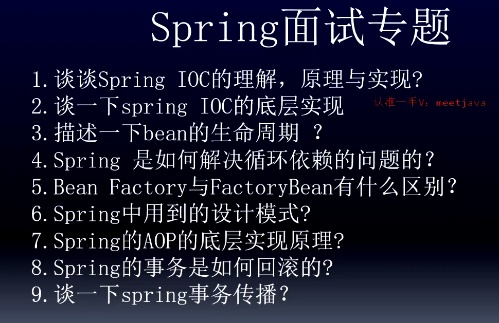

# Spring 专场

答题技巧：

总：当前问题回答的是哪些具体的点

分：以1,2,3,4 的方式分细节取描述相关的知识点，如果有不清楚的直接忽略过去，突出一些技术名词。

## 1.谈谈Spring IOC 的理解，原理和实现

### 总：

控制反转：思想理论，原来的对象是由使用者进行控制，有了spring之后，可以把整个对象交给Spring帮我们进行管理。

DI：依赖注入。把对应的属性的值注入到具体的对象中。例如 @Autowired

容器：存储对象，使用map结构来存储，在spring中一般存在三级缓存，singletonObjects存放完整的bean对象，整个bean的生命周期，从创建到使用到销毁的过程全部都是由容器来管理。（bean的生命周期）

### 分：

1. 一般聊ioc容器的时候要设计到容器的创建过程(beanFactory,DefaultListableBeanFactory),向bean工厂中设置一些参数(BeanPostProcessor，Aware接口的子类)等等属性

2. 加载解析bean对象，准备要创建的bean对象的定义对象beanDefinition，（xml或者的解析过程）

3. beanFactoryProcessor的处理，此处是扩展点，placeHolderConfigurSupport,ConfigurationClassPostProcessor
4. BeanPostProcessor 的注册功能，方便后续对bean对象完成具体的扩展功能
5. 通过反射的放射讲beanDefinition对象实例化成具体的bean对象
6. bean对象的初始化过程(填充属性，调用aware子类的方法，BeanPostProcessort前置处理方法，调用init-method方法，调用BeanPostProcessor的后置处理方法)
7. 生成完成的bean对象，通过getBean方法可以直接获取
8. 销毁过程

这是我对ioc的整体理解，包含了一些详细的处理过程，您看一下有什么问题，可以指点我一下。

忘了怎么办：

  spring中的bean都是通过反射的方式生成的，同时其中包含了很多的扩展点，比如最常用的BeanFactory的扩展，对bean的扩展(对占位符的处理)，ioc最核心的也就是填充具体bean的属性和生命周期。