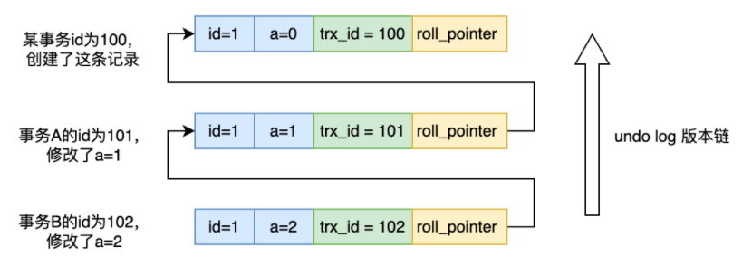
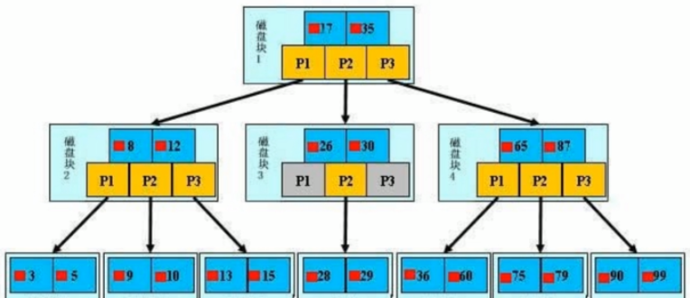
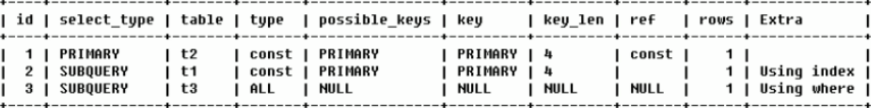

# 复习-Mysql

## 基础知识

DQL：（Data Query Language）查询块

DML：（Data Manipulation Language）数据库操纵语言（insert，update，delete，select）

DDL：（Data Definition Language）数据定义语言（CREATE、DROP）


## 事务

事务的特性 

A：原子性(要么全部成功，要么全部失败)

C：一致性(事物前后的数据完整性要保证一致,其他三种特性保证了一致性)

 I：隔离性(事务之间是隔离的，不会被其他线程干扰)

D：持久性（事务一旦提交，就持久化到数据库中了）


### 原子性实现：

undo log - rollback


### 隔离性实现：

隔离性分为四个级别：

#### 读未提交

加读锁，写锁

问题：脏读

写锁在修改完数据之后就释放了，其他的线程进行

读取数据，然后事务未提交，回滚，这时候就会产生脏读。


#### MVCC

Multi-Version Concurrency Control

是MySQL解决读写冲突的一种无锁的策略

##### mvcc的实现：undo 版本链

undo 版本链就是指undo log的存储在逻辑上的表现形式，它被用于事务当中的**回滚操作**以及**实现MVCC**



#### Read View

是MySQL 源码中的一个类
事务进行 快照读 的时候生产读视图 

read view表示快照读，这个快照读会记录四个关键的属性：

**create_trx_id**: 当前事务的id
**m_idx**: 当前正在活跃的所有事务id（id数组），没有提交的事务的id
**min_trx_id**: 当前系统中活跃的事务的id最小值
**max_trx_id**: 当前系统中已经创建过的最新事务（id最大）的id+1的值


#### 读已提交

**MVCC+Read View**

在操作写操作前加行锁，且不马上释放锁，提交事务之后才释放，

Read View 在读已提交的隔离级别下，会每次都进行更新，获取最新的事务快照。

所以A创建事务查询之后，B修改数据提交事务，A再进行查询，会更新Read View ，查询到最新的已提交事务，得到最新的值，所以出现了不可重复读的问题。


问题：不可重复读

A 查询， B修改 ，且提交事务，A再查询 ，发现数据不一致。

#### 可重复读

在操作写操作前加行锁，且不马上释放锁，提交事务之后才释放。

**MVCC+Read View**

Read View 在执行第一条sql的时候，进行创建，并且不会进行更新，那么A创建事务查询之后，即使B进行修改提交事务，A查询ReadView 还是会查询到原本的数据。解决了脏读，不可重复读的问题。


问题：幻读

A 查询 B 添加，且提交了事务，A再查询，发现结果集行数增加了。

#### 序列化

该隔离级别会自动在锁住你要操作的整个表的数据，如果另一个进程事务想要操作表里的任何数据就需要等待获得锁的进程操作完成释放锁。可避免脏读、不可重复读、幻读的发生。当然性能会下降很多，会导致很多的进程相互排队竞争锁。


### 持久性实现：

binlog/redo log

以及 主从复制


### 一致性

一致性其实就是以上三个特性的实现


## 存储原理

Innodb 的底层存储结构使用的B+树，



### B+树特点

**叶子节点具有相同的深度**

**节点中的数据索引从左到右递增排列**

**叶子节点存储数据**

**叶子节点之间使用指针连接**：

​	进行范围查找的效率高

**非叶子节点存储索引(到叶子节点的索引)**：

​	内存加载磁盘数据的时候，会根据磁盘块来进行加载，每次读取16K的磁盘块加载进内存，因为非叶子节点没有存储数据，所以包含更多的索引，可以更大范围的存储/寻找内容；


InnoDB 和 MyIAM 都是使用的B+树，有什么区别呢？

InnoDB 使用聚簇索引 + 非聚簇索引

MyISAM 使用非聚簇索引 ，叶子节点保存着 数据文件的指针


### 聚簇索引-非聚簇索引

**非聚簇索引**

叶子节点保存着数据行的位置，mysql中保存着主键

**聚簇索引**

聚簇索引保存着索引和数据内容


### 索引的优点

减少了扫描量

将随机IO变为顺序IO


### InnoDB 的特性

#### 插入缓冲（Insert Buffer/change buffer）

在硬盘的共享空间维护一个非聚簇索引，当需要用到索引页的时候，加载进 缓冲池的，然后再进行数据的插入和修改，

如果有多个IO操作，就会合并为一个IO操作。


实际上，非聚簇索引 也就是二级索引页，如果不在缓冲池中， 那么需要随机io读取二级索引页，以及聚簇索引页，造成多次io

效率下降，所以mysql 维护了一块 change buffer，用来缓存二级索引页不在缓冲池中的数据。省去了这次随机磁盘io。


#### 两次写(Double Write)

开辟2M的内存缓冲空间，同时也会在硬盘里开辟2M的共享空间，修改或者更新pagecache 的时候，不会立马更新到磁盘中，

而是先复制到**内存**doublewrite buffer中，然后分两次 每次 1 M写入到共享空间中且立马刷新到磁盘，

#### 自适应哈希索引（Adaptive Hash Index）

InnoDB会监控对表上**索引页**的查询，并会自动根据访问的频率和模式来自动地为某些**热点页**建立哈希索引。

#### 异步IO （Async IO）


#### 刷新临接页（Flush Neighboor Page）

刷新脏页的时候，会检测该脏页所在的区（一个区为1M的连续地址）是否还有其他的脏页，如果有就会一起进行刷新，这样就可以将多个IO操作合并为1个IO操作（固态硬盘有很高的随机IO能力，可以关闭这一特性，以提升性能）。

## 主从复制

binlog：binary log，主库中保存所有更新事件日志的二进制文件。


master ： log dump线程，当binlog有变动时，log dump线程读取其内容并发送给从节点。

slave： 

- 从节点I/O线程接收binlog内容，并将其写入到relay log 文件中。

- 从节点的SQL线程读取relay log文件内容对数据更新进行重放，最终保证主从数据库的一致性。


注:主从节点使用 binglog文件+ position偏移量来定位主从同步的位置，从节点会保存其已接收到的偏移量，如果从节点发生宕机重启，则会自动从position的位置发起同步。


**全同步复制**
主库写入binlog后强制同步日志到从库，所有的从库都执行完成后才返回给客户端，但是很显然这个方式的话性能会受到严重影响。

**半同步复制**
和全同步不同的是，半同步复制的逻辑是这样，从库写入日志成功后返回ACK确认给主库，`主库收到至少一个从库的确认就认为写操作完成`。


## 读写分离


## 分库分表


## 调优

### 执行计划

​	expain 查看执行计划，是调优的一个重要手段。

字段如下：



```
1.id :是一个有顺序的编号，是查询的顺序号，有几个select就显示几行。id的顺序是按select 出现的
顺序增长的。id列的值越大执行优先级越高越先执行，id列的值相同则从上往下执行，id列的值为NULL最后执行
2.selectType表示查询中每个select子句的类型
3.table:表示该语句查询的表
4.type:优化sql的重要字段，也是我们判断sql性能和优化程度重要指标。他的取值类型范围:.

const:通过索引一次命中，匹配一行数据

system:表中只有一行记录，相当于系统表;

eq_ref:唯一性索引扫描，对于每个索引键，表中只有一条记录与之匹配

ref:非唯一性索引扫描,返回匹配某个值的所有

range:只检索给定范围的行，使用一个索引来选择行，一般用于between、<、>;index:只遍历索引树;

ALL:表示全表扫描，这个类型的查询是性能最差的查询之一。那么基本就是随着表的数量增多，执行效率越慢。

5.possible_keys:它表示Mysql在执行该sql语句的时候，可能用到的索引信息，仅仅是可能，实际不一定会用到。
6.key:此字段是 mysql在当前查询时所真正使用到的索引。他是possible_keys的子集
7.key_len:表示查询优化器使用了索引的字节数，这个字段可以评估组合索引是否完全被使用，这也是我
门优化sql时，评估索引的重要指标
9.rows: mysql查询优化器根据统计信息，估算该sql返回结果集需要扫描读取的行数，这个值相关重要，索引优化之后，扫描读取的行数越多，说明索引设置不对，或者字段传入的类型之类的问题，说明要优化空间越大
10.filtered:返回结果的行占需要读到的行(rows列的值)的百分比，就是百分比越高，说明需要查询到数据越准确，百分比越小，说明查询到的数据量大，而结果集很少
11.extra

using filesort:表示mysql对结果集进行外部排序，不能通过索引顺序达到排序效果。一般有using filesort都建议优化去掉，因为这样的查询cpu资源消耗大，延时大。
using index:覆盖索引扫描，表示查询在索引树中就可查找所需数据，不用扫描表数据文件，往往说明性能不错。
using temporary:查询有使用临时表,一般出现于排序，分组和多表join的情况，查询效率不高，建议优化。
using where : sql使用了where过滤,效率较高。
```

### 索引

#### 优点

减少扫描量

增快查询效率：相当于目录

将随机IO变为顺序IO

#### 分类

主键索引

唯一索引

普通索引

全文索引

组合索引


#### 名词解释

##### 回表

使用辅助索引查找聚簇索引页，找到id

然后使用id 到非聚簇索引找到行信息

##### 覆盖索引

组合索引里的索引都被用上了，例如： name_age 索引 ，where name = '1' and age = 19

##### 最左匹配

最左匹配原则，就是索引从左往右，不能跳跃 例如name_age 索引  where age = 19 此时就是没有索引的，但是name = '1' 就是有走索引的

##### 索引下推

即使没有走覆盖索引，但是条件里面还是有索引信息，会先过滤索引信息里的数据，再进行扫描磁盘数据

例如： name like '123%' and age = 19 ,此时走索引 name_age ,但是age索引失效，过滤出5条数据，此时如果没有索引下推，就会回表过滤

但是索引下推，就直接过滤age = 19的数据


#### 索引使用的优化点

1. 使用索引列进行查询的时候，尽量不用函数和表达式，将计算放到业务层
2. 使用主键查询或者是 查询索引有的字段 少用 select * ， 否则会触发回表
3. 使用索引列 来排序
4. 强制类型转换 会使用全文扫描
5. 更新频繁 和 数据区分度 不高的 不用索引
6. 少用 null 列 作为索引


### 查询优化

慢的原因：

1. 网络
2. cpu
3. io
4. 上下文切换
5. 系统调用
6. 锁


如何解决：

	1. 使用缓存
	1. 优化关联查询，关联条件上一定要加索引，以及关联不要超过3张表，
	1. group by 以及 order by 中 只用一个表的列这样才能用索引进行优化
	1. 子查询 最好使用关联查询进行替代
	1. 进行分区

