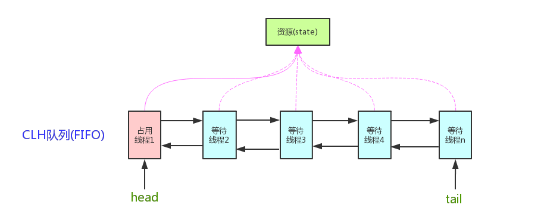

# 复习-并发&网络&IO

## 并发

引用：https://blog.csdn.net/qq_41969358/article/details/120592488

### 并发三要素： 

可见性：一个线程对共享变量的修改，其他线程可以感知到

原子性：一个操作或者多个操作，要么全部成功，要么全部失败

有序性：程序的指令按照编码顺序执行，避免指令重排

产生问题的原因：

可见性：cpu高速缓存带来的可见性问题

原子性：线程切换

有序性：编译优化，导致的指令重排

### 串行、并发、并行

串行 ：一个队列里多个任务，按顺序执行

并发：一个CPU，多个任务，分片执行

并行：多个CPU，多个任务，同时进行

### 线程和进程

进程是操作系统分配资源的最小单位。

线程是处理器调度和执行的基本单位。

每个进程最少一个一个线程。

### 上下文切换

当前任务在执行完cpu时间片的时候，会进行保存当前的环境和状态，以便下个时间片到来的时候，切换回来进行读取。

### 死锁：

死锁的四个必要条件:

1. 互斥
2. 请求与保持
3. 循环等待
4. 不可抢占式

### 多线程

创建方式： 

1. 继承Thread 类
2. 实现Runnable接口
3. 实现Callable 接口

### 线程的生命周期

new

runnable

wait

time_wait

blocked

terminal

### 线程池ThreadPoolExecutor

构造器的7个参数：

1. `corePoolSize`： 核心线程数量
2. `maximumPoolSize`： 最大线程数量
3. `keepAliveTime`： 空闲时间，当线程池数量超过核心线程数时，多余的空闲线程存活的时间，即：这些线程多久被销毁。
4. `unit`：空闲时间的单位，可以是毫秒、秒、分钟、小时和天，等等
5. `workQueue`: 等待队列，线程池中的线程数超过核心线程数时，任务将放在等待队列，它是一个`BlockingQueue`类型的对象
6. `threadFactory`: 线程工厂，我们可以使用它来创建一个线程，设置线程的名称等
7. `handler`: 拒绝策略

### synchronized

#### synchronized的使用

原子性，有序性，可见性，可重入性

synchronized 是用来控制线程同步的，同一时间内，synchronized修饰的临界区内，只能有一个线程执行。

synchronized可以修饰代码段，静态方法，实例方法，

#### synchronized的原理

对象是由 对象头、实例数据、对齐填充 三部分组成的，对象头是由 mark work 和 类的元数据信息组成的，

mark work 中 保存着 对象的 `hashCode` 锁信息 或 分代年龄 或 GC 标志等信息。

#### synchronized 的锁膨胀

无锁-> 偏向锁 -> 轻量级锁 -> 重量级锁

偏向锁： 不存在多个线程同时竞争，第一个线程获取锁的时候，记录该线程ID，当其他线程访问的时候，自动释放

轻量级锁：当一个线程持有锁，另一个线程在等待的时候，通过自旋锁来进行等待，当自旋次数到达一定程度，或者第三个线程竞争的时候，升级为重量级锁

重量级锁： 

每个对象也都存在着一个`ObjectMonitor` 对象(C++ 实现)

`ObjectMonitor`中存在两个队列，一个等待队列，一个持有队列，还有一个count

当`ObjectMonitor`被线程持有后，其他线程访问就会进入 等待队列。当持有锁的线程调用wait之后，等待队列将会变成null，

等待队列将会被唤醒。

使用`javap`	 反汇编之后会发现，命令为 `monitorenter` `monitorexit`

### Volatile

保证可见性和有序性。

### CAS

乐观锁，compare and set ， 通过设定预期值 比较 原来的值是否相等 才进行更新，否则失败

### AQS

核心原理就是如果请求的共享资源空闲，则将其请求资源的线程作为可以运行的线程，然后将共享资源设置为锁定状态，

如果请求的资源被占用，则加入队列，等待被唤醒。

原理：

CLH （虚拟双向队列）

`volatile int state`

使用`cas`操作 更新 state

`synchronized` 和 `ReentrantLock`的不同点：

1. synchronized 是关键字，而`ReentranLock`的类，类可以被继承扩展，扩展性高
2. synchronized 是自动加锁，释放锁，`ReentrantLock` 需要手动
3. synchronized 可以给方法，代码块，而`ReentrantLock` 只能给代码块
4. 底层实现不一样，synchronized 使用对象头的mark work  和 `objectMonitor` 但是 `ReentrantLock`使用unsafe类的 park方法
5. `ReentrantLock` 提供了无条件的`Lock.lock()`,  尝试获取 `Lock.tryLock()`, 超时`Lock.tryLock(Time)`，公平锁，非公平锁
6. AQS 还衍生出了 `ReentrantReadWriteLock`

非公平锁：新加入的获取锁的线程，会多次获取锁，如果都获取不到，则会进入等待队列，和公平锁一样了。

公平锁：加入了等待队列，通过队列顺序进行获取锁。

### ThreadLocal

每个线程都会在内部维护一个ThreadLocalMap ，

ThreadLocalMap 的 key 为 弱引用的ThreadLocal，value 为实际数值。

产生内存泄露的原因是：在web环境下，一个线程会存在很久，key由于是弱引用会被垃圾回收掉，但是value还是根可达状态，不会被回收，

所以造成了内存泄露。如果要解决就把threadlocal设置为static final，或者每次都要进行显示的remove.

## IO相关

`pagecache`: 是由内核进行维护的一个缓存，大小为4k，在读取磁盘的时候，会进行缓存，如果进行写操作，会变成脏页`pagecache`，

可以立马刷回磁盘，也可以定时刷回磁盘。

`stream 和 bufferStream`: 流每次读写都会进行修改`pagecache`，但是buffer会积攒到一定程度才会进行修改(jvm 默认8k).

### BIO

BIO的定义：BIO 中的B 代表 block 阻塞的意思，在进行网络IO 的时候，connect，read，write，都可能产生BIO，因为不知道对方什么时候准备好 连接、发送数据、读取数据，所以就阻塞在那里了，通常做法是一个线程处理一个网络请求，但是这样会造成线程过多，浪费空间，而且因为上下文切换，也会造成大量的开销。

### NIO

NIO 的做法就是，不管是connect 还是 read 都不会进行阻塞，而是如果没有连接，或者数据，就会返回-1，然后进行轮询，这样就不会造成大量线程都处于阻塞状态了，但是还有问题就是每次read 都需要系统调用从用户态切换成内核态，会不断调用，浪费性能。

### 多路复用

那么上面的问题怎么解决呢？怎么样才能不产生大量的系统调用？

程序只需要调用1次系统调用，就能获取到所有fd 是否有产生数据变化，就好了，这就是多路复用

多路复用也有多种实现方式：

select:

将fds 复制进内核态，然后内核态进行查看fd的buffer 是否有数据变化，然后修改状态返回给程序。

poll:

和select类似，不过select 的 fd有限制最多1024，poll没有限制

epoll: 

epoll 在内核维护了一个红黑树，红黑树里面记录着所有的fd，当fd buffer 发生变化的时候，会将该fd 放进链表。

### mmap

程序IO 是通过用户态切换到内核态进行Read、Write ，这样会进行切换状态，产生系统调用。

mmap是通过直接开辟了堆外内存，映射到了pagecache上，可以直接进行修改，不会产生系统调用。

## 网络相关

`tcp、http`

#### 三次握手：

client 请求连接 server ， 发出一个 seq = x ， 客户端状态变为： syn-sent

server 端 返回 client ，返回报文：  acx = x + 1 ， seq = y ，	服务端状态变为 ： syn-received

client 再次发送信息，表示连接完成， 客户端和服务端状态都变为 ESTABLISHED

#### 四次挥手：

客户端发送消息，表示要断开连接，seq = x    客户端状态变为 fin_wait_1

服务端返回消息，表示可以断开连接，seq = x+1  服务端状态变为 close_wait  , 客户端变为 fin_wait_2

 -------------此时服务端 处理未完成的消息，会继续处理数据和发送数据，客户端虽然不发送数据了，但是还可以接收-----------

服务端发送断开连接消息 seq = j       , 服务端状态变为 LAST_ACK ，客户端接收之后变为	 Time_wait 

客户端断开连接并发送消息：seq = j+1  客户端等待2MSL之后变为CLOSE状态，服务端接收到之后，变为CLOSE状态。

为什么客户端需要等待2MSL的时间，因为客户端最后发送给服务端的消息，可能服务端会没有接收到，那么服务端会重新发送断开的报文。

`https`

http + tls协议： 通过tls协议证书 非对称秘钥， 获取对称秘钥，然后进行数据传输

对称加密 比 非对称加密速度快，因为对称加密是通过位运算，

非对称加密： RSA 、D-H 、ECC

通常 公钥加密，私钥解密 用来加密信息

私钥加密，公钥解密，用来验证签名

对称加密： DES 3DES IDEA 等；
