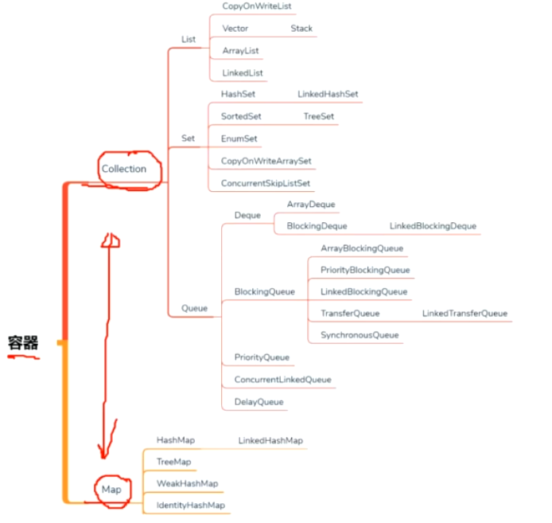

# 集合容器

如上图所示，集合其实就是一个容器，他们可以装载数据，底层其实都是数组和链表结构，

集合分为 Collection 和 Map ，Collection里有 常见的Vector，ArrayList、HashSet、Queue ，Map中有常见的Hashtable，HashMap，TreeMap、ConcurrentHashMap等。

他们又分为线程安全的和线程不安全的，基础部分就跳过吧，直接来讲讲常用的。

## HashMap

1. 存储结构

   hashMap在jdk1.8开始，存储结构变为 数组 + 链表 + 红黑树的形式(数组>64 && 链表长度 > 8)

2. 如何解决hash冲突

​		在hash数组，冲突的时候，会进行链表尾插法插入，或者插入树中，但是hashmap还重做了hash算法，让冲突减少，

​		那就是使用了 hashcode() ^ hashcode()>>>16   &  n-1        ，且n 一定是2的n次方。  为什么时候2的n次方呢，是因为这样可以使

​		hash算法最大程度的均匀分配，&运算，是只有同时为1 才能为1，2的n次幂-1，全部都为1.

3. 如何进行扩容

   loadFactor：加载因子  0.75 

   threshold: loadFactor * initailCapacity 

   当数组真实长度达到 threshold 的时候会触发自动扩容机制， 大小为原本数组的两倍，原数组下的所有链表里的元素，会进行重新计算，

   使用 (n-1) & hashcode 即可查找出最高位是1还是0，如果是0则加入低位链表(链表处于原位置)，如果是1则加入高位链表(原位置 + oldCapacity)

4. 为什么使用红黑树？

   为了增加查询效率，红黑树是一种自平衡的二叉查找树，红黑树限制了任意节点到根节点中的黑色节点都相等，且红色节点不能连续，所以最长路径最多是

   最短路径的两倍。二叉查找树可能会因为深度过深，导致查询效率低，AVL 平衡树，则是因为高度平衡，插入和删除的时候，必须经过多次旋转，导致的插入，删除效率过低。

5. 多线程下会发生什么情况？

​		并发情况下，put元素，如果是在同一个数组位置，会导致数据丢失，

​		扩容的时候，复制原链表元素，会丢失数据。

## ConcurrentHashMap

ConcurrentHashMap 的数据结构和hashmap 相同，不同的是，在put 和 扩容的时候，做了 cas 操作 或者 加了锁。(晚上调试一下看看)；

## 红黑树

使用红黑颜色代替高度平衡的平衡二叉树，维持自平衡，最长路径最多是最短路径的两倍。

是一颗二叉查找平衡树。通过左旋，右旋，和 更换颜色，来维持红黑树的特性。

特性：

1. 只有红色和黑色
2. 根节点为黑色
3. 叶子节点为黑色
4. 红色节点不能连续
5. 每个结点到叶子节点的黑色节点都一致

