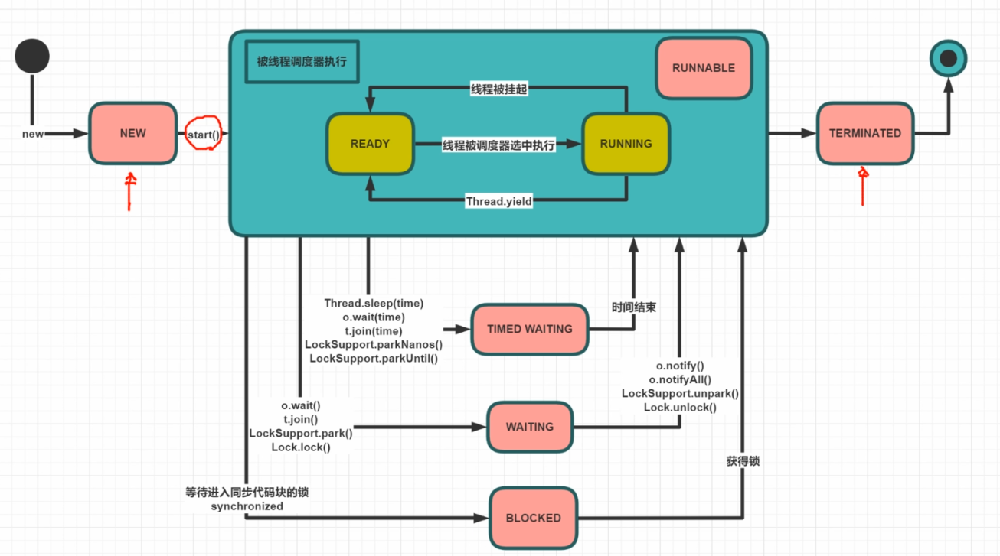
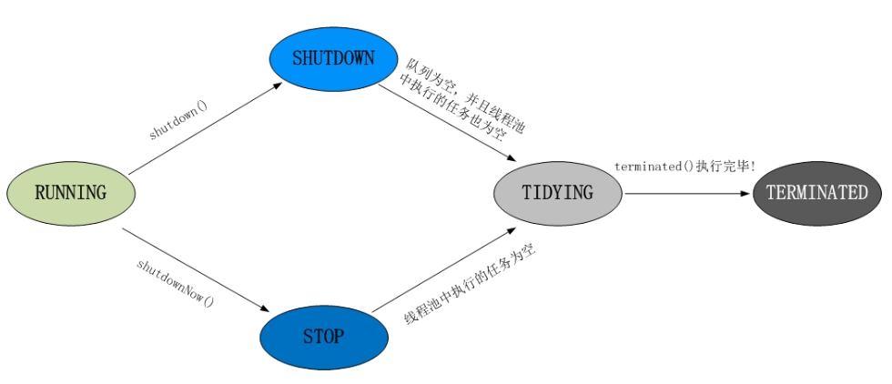

# 多线程与高并发

## 程序、进程、线程

程序是是一组指令的有序集合

进程是资源分配的最小单位，程序运行后，进程在内存占用资源。

线程是CPU执行调度的最小单位。进程里可以有多个线程。

### 问题

#### 1.单核CPU设定多线程是否有意义？

有意义。因为线程可能在等待IO资源。此时不占用CPU

#### 2.工作线程数是不是设置越大越好？

不是。线程的切换会占用CPU的资源，线程多反而会降低效率。

#### 3.工作线程数（线程池中线程数量）设多少合适？

根据CPU的核数。需要根据实际情况压测来寻找合适的线程数。

公式：


线程数 = CPU核数 * 期望CPU利用率 * （1+等待时间/计算时间）

## 创建线程的5种方法

### 1. extend Thread

### 2. implement Runnable

### 3. new Thread（lambda）

new Thread(()-{

}).start

### 4. implement Callable<T>

直接扔进线程池，submit 

或者是new FutureTask，然后再扔进new Thread

```
FutureTask<V> task = new FutureTask<>(callable)

new Thread(task).start();

FutureTask可以直接放到线程池里执行
```


### 5.线程池 ThreadPool

ExecutorService service = Executors.newCachedThreadPool(1)

service .submit()

servuce.shutdown()


## 线程的状态

### NEW

线程刚刚被创建

### RUNNABLE（READY、RUNNABLE）

可运行状态

### WAITING

等待被唤醒

### TIMED WAITING

隔一段时间自动唤醒

### BLOCKED

被阻塞

### TERMINATED

线程结束



## Synchronized

public synchronized static method(){}

锁的是T.class 类

public synchronized method （）{}

锁的是this 这个对象

synchronized(Object){}

锁的是Object这个对象

### 是可重入锁

即同步方法内可以继续调用本类的同步方法。

### Synchronized 底层

偏向锁 ： markword 记录这个线程的ID

如果有线程争用这把锁，升级为自旋锁

10次以后升级为操作系统重量级锁 - OS


执行时间段（加锁代码）,线程数少，用自旋锁

执行时间长，线程数多，用系统锁


## ReentrantLock

### 与synchronized 的共同点

1. 都是用来协调多线程对共享对象、变量的访问

2. 都是可重入锁，同一线程可以多次获得同一个锁

3. 都保证了可见性和互斥性

### 与synchronized 的不同点

1. ReentrantLock 显示的获得、释放锁，synchronized 隐式获得释放锁

2. ReentrantLock 可响应中断、可轮回，synchronized 是不可以响应中断的，为处理锁的
   不可用性提供了更高的灵活性

3. ReentrantLock 是 API 级别的，synchronized 是 JVM 级别的

4. ReentrantLock 可以实现公平锁

5. ReentrantLock 通过 Condition 可以绑定多个条件

   ```
   例如:
   Condition consumer= ReentrantLock.newCondition()
   Condition producer= ReentrantLock.newCondition()
   //producer 休眠生产者
   producer.await()
   //consumer 唤醒消费者进行消费
   consumer.signalAll()
   ```

   

6. 底层实现不一样， synchronized 是同步阻塞，使用的是悲观并发策略，lock 是同步非阻
   塞，采用的是乐观并发策略

7. Lock 是一个接口，而 synchronized 是 Java 中的关键字，synchronized 是内置的语言实现。

8. synchronized 在发生异常时，会自动释放线程占有的锁，因此不会导致死锁现象发生；
   而 Lock 在发生异常时，如果没有主动通过 unLock()去释放锁，则很可能造成死锁现象，
   因此使用 Lock 时需要在 finally 块中释放锁。

9. Lock 可以让等待锁的线程响应中断，而 synchronized 却不行，使用 synchronized 时，
   等待的线程会一直等待下去，不能够响应中断。

10. 通过 Lock 可以知道有没有成功获取锁，而 synchronized 却无法办到。

11. Lock 可以提高多个线程进行读操作的效率，既就是实现读写锁等

## Volatile 

### 1. 保证线程可见性

### 2. 禁止指令重排

DCL单例 的 INSTANCE 是否需要加Volatile？

需要，原因是不是可见性，而是禁止指令重排，new 对象的时候分为三部曲，一申请内存，初始化值，二 赋值，三 地址引用。

如果指令重排，可能出现 一 三 连续，这时候其他线程引用，就会出现值是初始化的，而不是赋值后的值


## CAS(乐观锁\无锁，线程安全)

- compare and set

- cas(V,Expeceted,NewValue)

  -if V == E

     V = new 

  otherwise try again or fail

- ABA 问题
  
  - 加version

### Atomic

### Unsafe

直接操作虚拟机对象

## CountDownLatch

线程安全,当countDownLatch 等于0的时候，放行

如何使用？

1.创建对象

CountDownLatch latch = new CountDownLatch(size);

2.使用

latch.countDown();  相当于 count--;


3.latch.await();

latch>0的时候阻塞

当latch等于0的时候，放行 


## CyclicBarrier

线程安全，当cyclicBarrier 满足设置的值时，放行

1. CyclicBarrier cyclicBarrier= new CyclicBarrier(patiers,（）->{}）


2. 在其他线程里面，使用cyclicBarrier.await(),

   当阻塞的线程数到达设定的数时，执行第二个参数里的线程


## Phaser

按照不同阶段对线程执行

```
MarriagePhaser phaser = new MarriagePhaser();


phaser.bulkRegister(size)

//等待这个阶段接受的线程到齐，之后才能开启下个阶段
phaser.ariveAdndAwaitAdvance();

//此线程结束phaser的分段，不需要下个阶段了，且注册的阶段-1即可放行
phaser.arriveAndDeregister();


class MarriagePhaser extends Phaser{
	@Override
    protected boolean onAdvance(int phase, int registeredParties) {
    	//phase 第几个阶段
    	//registeredParties 目前有多少线程
    	//结束return true
    }

}


```

## ReadWriteLock

- 共享锁 （S锁）(读锁) 可以有多个线程并发地读数据
- 排他锁（X锁） (写锁) 每次只能有一个写线程


```
readWriteLock = new ReentrantReadWriteLock()
//共享锁
Lock readLock = readWriteLock.readLock();
//排他锁
Lock writeLock = readWriteLock.writeLock();
```

## Semaphore

限流: 最多只能有多少个线程并行

信号量

```
//允许一个线程同时执行
Semaphore s = new Semaphore(1);

//阻塞方法，如果acquire不到，则阻塞
s.acquire();

//释放s
s.release();
```

公平锁（默认不公平）

```
//允许2个线程同时执行,公平锁
Semaphore s = new Semaphore(2,true);
```

## Exchanger

交换数据

```
Exchanger<String> exchanger = new Exchanger<>();

//阻塞方法，两个线程互相交换线程信息
exchanger.exchange("");
```

## LockSupport

```
// 当前线程停止
LockSupport.park()

//解封
LockSupport.unpark(t);

先执行unpark 会导致后续的一次park 失效

```

## AQS

AQS(`AbstractQueuedSynchronizer`)，AQS是JDK下提供的一套用于实现基于FIFO等待队列的阻塞锁和相关的同步器的一个同步框架。

### VarHandle

1.普通属性也可以操作原子操作.

2.比反射快


## ThreadLocal

用处：spring事务 数据库连接

是每个线程独有一份

Thread.currentThread.Map

## 强软弱虚

引用有四种

- 强引用：只要对象有强引用，垃圾回收不会回收

- 软引用：对象被软引用指向，当系统堆内存不足了，会被回收

  ```java
  SoftReference<> soft = new SoftReference<>()
  ```

- 弱引用：只要有垃圾回收，就会被回收

```
WeakReference<> w = new Reference<>()
ThreadLocal
```

- 虚引用：相当于没有引用

```
PhantomReference<> p = new PhantomReference<>(new M(),QUEUE)
// 给用到堆外内存的人用的
// QUEUE能拿到这个被回收的值，通过queue清理内存
```

## 线程安全集合容器


### Vector、Hashtable

-线程安全，加了锁


### Collections 工具栏

Collections.synchronizedMap（hashMap）;

将hashMap 加锁，但是效率比较低


### ConcurrentHashMap

插入效率较低，读效率较高

底层CAS


### ConcurrentSkipListMap

排序的线程安全的Map


### CopyOnWriteList

写时加锁，复制

读时，不加锁，因为读的是复制后的数据，


适用于，读多写少的情况下。

### Queue

offer 添加，返回是否成功

add 超出数量报异常

peek

poll

size

#### LinkedBlockingQueue

BlockingQueue 阻塞队列

阻塞方法

put 添加，如果满了会阻塞

take 取，如果为空会阻塞

#### ArrayBlockingQueue

有界的，BlockingQueue

#### PriorityQueue

优先级阻塞队列，内部是一个二叉树，最小堆

#### DelayQueue

延迟阻塞队列，按照对象设置的时间排序

作用：按时间进行任务调度

#### SynchronusQueue

容量为0，用来让一个线程给另一个线程下达任务的

只有能使用阻塞方法来进行take 和 put ,并且只有take在put之前才可以take到。

#### TransferQueue

LinkedTransferQueue

LinkedTransferQueue采用一种预占模式。意思就是消费者线程取元素时，如果队列不为空，则直接取走数据，若队列为空，那就生成一个节点（节点元素为null）入队，然后消费者线程被等待在这个节点上，后面生产者线程入队时发现有一个元素为null的节点，生产者线程就不入队了，直接就将元素填充到该节点，并唤醒该节点等待的线程，被唤醒的消费者线程取走元素，从调用的方法返回。我们称这种节点操作为“匹配”方式。


transfer（e）;

装进容器里，此线程就阻塞了。等待消费者消费了就放行了

## Future

Callable  -> Runnable + ret

Future -> 存储执行的将来才会产生的结果

FutureTask -> Future + Runnable + ret


### CompletableFuture

CompletableFuture是对多个Future的管理类

运行一个任务，存储一个结果在任务里

```
//执行线程
CompletableFuture.supplyAsync(runnable);

//对任务堆的管理
CompletableFuture.allOf(future1,future2).join()
```

## 线程池

线程池的作用：

提高系统效率，不需要频繁的创建和销毁线程，降低资源消耗，提高响应速度，提高线程的可管理性

- ThreadPoolExecutor
  - 多个线程共享一个任务队列
- ForkJoinPool
  - 每个线程有自己的任务队列
  - 分解汇总任务
  - 用很少的线程可以执行很多的任务（子任务）TPE做不到先执行子任务
  - CPU密集型

### 线程池的状态




- RUNNABLE
  - 状态说明：线程池处在RUNNING状态时，能够接收新任务，以及对已添加的任务进行处理。 
  - 状态切换：线程池的初始化状态是RUNNING。换句话说，线程池被一旦被创建，就处于RUNNING状态，并且线程池中的任务数为0
- SHUTDOWN
  - 状态说明：线程池处在SHUTDOWN状态时，不接收新任务，但能处理已添加的任务。 
  - 状态切换：调用线程池的shutdown()接口时，线程池由RUNNING -> SHUTDOWN。
- STOP
  - 状态说明：线程池处在STOP状态时，不接收新任务，不处理已添加的任务，并且会中断正在处理的任务。 
  - 状态切换：调用线程池的shutdownNow()接口时，线程池由(RUNNING or SHUTDOWN ) -> STOP。
- TIDYING
  - 状态说明：当所有的任务已终止，ctl记录的”活跃线程数”为0，线程池会变为TIDYING状态。当线程池变为TIDYING状态时，会执行钩子函数terminated()。terminated()在ThreadPoolExecutor类中是空的，若用户想在线程池变为TIDYING时，进行相应的处理；可以通过重载terminated()函数来实现。 
  - 状态切换：当线程池在SHUTDOWN状态下，阻塞队列为空并且线程池中执行的任务也为空时，就会由 SHUTDOWN -> TIDYING。 
    当线程池在STOP状态下，线程池中执行的任务为空时，就会由STOP -> TIDYING。
- TERMINATED
  - 状态说明：线程池彻底终止，就变成TERMINATED状态。 
  - 状态切换：线程池处在TIDYING状态时，执行完terminated()之后，就会由 TIDYING -> TERMINATED。


### ThreadPoolExecutor

7个参数

```
ThreadPoolExecutor tpe  = new ThreadPoolExecutor(int corePoolSize,//核心线程数
int maximumPoolSize,//最大线程数
long keepAliveTime,空闲时间，如果线程长时间没有任务，则销毁
TimeUnit unit,//keepAliveTime的单位
BlockingQueue<Runnable> workQueue,
ThreadFactory threadFactory,
RejectedExecutionHandler handler
)
```

- corePoolSize 核心线程数
- maximumPoolSize 最大线程数
- keepAliveTime 空闲时间，如果线程长时间没有任务，则销毁
- unit keepAliveTime的单位
- workQueue 工作队列
  - ArrayBlockingQueue(capacity)
  - LinkedBlockingQueue
- threadFactory 线程工厂，需要自己定义
  - 创建线程或线程池时请置顶有意义的线程名称，方便出错时回溯
- RejectStrategy 拒绝策略，线程数不够用，而且队列满了，则要使用到拒绝策略，JDK提供4种拒绝策略，如下
  - AbortPolicy 对拒绝任务抛弃处理，并且抛出异常。
  - DiscardPolicy 对拒绝任务直接无声抛弃，没有异常信息。
  - DiscardOldestPolicy 对拒绝任务不抛弃，而是抛弃队列里面等待最久的一个线程，然后把拒绝任务加到队列。
  - CallerRunsPolicy 这个策略重试添加当前的任务，他会自动重复调用 execute() 方法，直到成功。遵循线程数不够的情况下，谁调用，谁执行


### Executors-线程池的工程

不允许使用Executors进行创建线程池

1. FixedThreadPool 和 SingleThreadPool: 允许的请求队列长度为 Integer.MAX_VALUE，可能会堆积大量的请求，从而导致 OOM。 
2. CachedThreadPool 和 ScheduledThreadPool: 允许的创建线程数量为 Integer.MAX_VALUE，可能会创建大量的线程，从而导致 OOM。

#### FixedThreadPool 

#### singleThreadExecutor

为什么要有，一个线程数量为1的线程池？

有任务队列，生命周期管理

#### cacheThreadPool

使用的是SynchronousQueue 工作队列，如果来了一个任务，如果没有启动新线程，则会阻塞。

####  ScheduledThreadPool

定时任务线程池

使用的是DelayedWorkQueue,

#### workStealingPool

使用ForkJoin 线程池，实现分而治之


## ParallelStreamAPI

流式处理 并行流

```
list.parallelStream().forEach() 
```

## JMH

- Java Microbenchmark Harness 
  - java 微基准测试
  - 测试方法是否效率高


## Disruptor

- disruptor - 分裂 、 瓦解
- 一个线程中每秒处理600万订单
- 2011 年 Duke 奖
- 速度最快的MQ
- 性能极高，无锁CAS，单机支持高并发


## 随笔：

### wait/notify

wait 释放锁，线程休眠

notify 线程不释放锁，唤醒线程