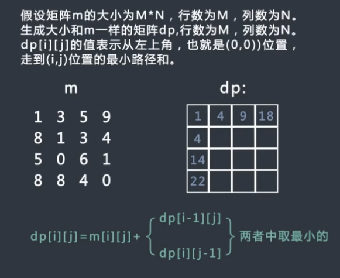

# 算法笔记

## 二插树

### 递归遍历

比较简单。

### 非递归遍历

#### 先序


本方法主要是使用栈的方式进行非递归先序遍历,由于栈是先进后出的，所以压栈的时候，先压右节点再压左节点。这样弹出的节点就是先左后右。

#### 中序


理解：将左边节点全部压入栈中，依次弹出栈顶元素，并且打印，取此元素的右节点，如果右节点为空则会继续上述弹出栈顶元素等操作，如果右节点不为空，则会继续按照左边节点压栈。

#### 后序


### 树的序列化和反序列化

#### 先序的序列化


需要用特殊符号区分节点与节点，

空位置也需要用特殊符号，否则难以得知树的整体结构

#### 按层序列化


### 平衡二叉树的判断

平衡二叉树是每一个子树的左右子树高度不超过1，

衍生出一种万能算法，即使用递归遍历。递归可以增加条件，可以增加返回值，返回高度，返回是否平衡。

### 搜索二叉树的判断

搜索二叉树的意思是，左子树<本节点<右子树。

隐藏的含义：中序遍历下，i < i+1 

可以使用非递归版中序遍历。

### 完全二叉树的判断

1. 一个节点的左子树为空，右子树不为空，则不是完全二叉树
2. （在1的条件下）一个节点的有子树，那么接下来的节点只能是叶子节点不然不是完全二叉树

可以使用队列，先进先出，就可以广度遍历了。

### 完全二叉树的节点个数，要求时间复杂度低于O(n)

如果存在右子树的最后一层的最左节点，说明左子树是满二叉树,可以使用公式计算出左子树的节点个数: 2^（n-1）-1 + 1  其中(n-1)代表层数,从第二层到最后一层,最后的+1 代表根节点。

如果不存在右子树的最后一层的最左节点：说明右子树是满二叉树，

计算出右子数的节点个数 2^(n-2) -1 + 1  其中(n-2)代表层数,从第二层到最后第二层,

如此递归，每一个节点为起点的子树都是完全二叉树，可以递归调用。


时间复杂度：O((log N)^2)

## 布隆过滤器

### 目的

布隆过滤器主要是为了解决缓存穿透问题：即数据库中没有，且缓存中也没有的数据，大量请求此种数据造成一直请求真实数据库，造成数据库的压力上升。

### 原理

布隆过滤器的原理，布隆过滤器的本质是一个bit数组，存放的都是0/1，当往布隆过滤器里添加数据的时候，经过多个hash算法，计算出每个hash在bit数组里的位置，把相应位置改为1，那么久相当于此数据存在于布隆过滤器里，

当要查询某数据是否在布隆过滤器里时，就需要将此数据进行多个hash算法，查询响应位置是否为1，如果全都是1，则可以判断数据可能存在，

### 优点

由于存放的不是完整的数据，所以占用的内存很少，而且新增，查询速度够快；

### 缺点

着数据的增加，误判率随之增加；无法做到删除数据；只能判断数据是否一定不存在，而无法判断数据是否一定存在。

## 一致性hash算法

目的：一致性hash主要是为了解决服务器负载均衡的问题。

原理：hash算法取模可以看做是一个闭环，如图所示


### 如何映射数据？

对数据进行hash，计算出对应的key值，key值在两个节点之间就顺时针取最近的服务器节点。

### 虚拟节点

由于一致性hash可能导致服务器分布不均衡，故引入虚拟节点，

如有A，B，C，D 四个真实服务器，则引入的虚拟节点对应A,B

C,D ，引入的虚拟节点均衡分布在每一个位置，

## 算法题

### 二叉树

#### 1.后继节点


后继节点：中序遍历的下一个节点

前驱节点：中序遍历的上一个节点

1. 方法一 找到头结点，中序遍历一次整颗树，再进行查找后继节点
2. 方法二 规律法

- 如果该节点有右子树，则后继节点是右子树上最左的节点
- 如果该节点没有右子树，则向上查找，直到查找到该节点是某一节点的左子树，则某一节点为后继节点

#### 2.设计RandomPool结构


使用两个hash表，一个记录key，size,一个记录 size,key

添加的时候，就往两个表里直接添加，然后size++，

随机返回，就从第二个hash表取随机数取出来，

删除：需要删除，并且将size--，且将最后一个size的填充到删除的位置


### 动态规划

#### 1.多张面值不同的货币，组成目标金额的方法

```
给定数组arr,arr中所有的值都为正数且不重复每个值代表一种面值的货币,
每种面值的货币可以使用任意张,再给定一个整数aim代表要找的钱数,求换钱有多少种方法。
```

```
暴力递归：
    public int coins1(int[] arr,int aim){
        if (arr == null || aim == 0 || arr.length == 0){
            return 0;
        }
        return process1(arr,0,aim);
    }

    /**
     * 暴力递归
     * 1.使用arr 中的下标为1 的面值，分别为0 ，1 ， 2 ，3 ···N张，递归 下标为2的面值 分别为0 ····N 张
     * @return
     */
    public int process1(int[] arr,int index,int aim){
        int res = 0;
        if (arr.length-1 < index){
            res =  aim==0?1:0;
        }else {
            for (int i = 0; arr[index] * i <= aim; i++) {
                res += process1(arr,index+1,aim -  arr[index] * i);
            }
        }
        return res;
    }
```

```
记忆搜索，由于 金额和货币 可能组成的方法数相等，
例如：index = 2 ，aim = 1000 会有多次计算，导致效率下降，可以使用map函数记录index 2 aim = 1000 时的方法数量，避免重复计算、
```

```
动态规划：

```


#### 2.给定矩阵求左上到右下的路径最小


```
给定一个矩阵m,从左上角开始毎次只能向右或者向下走,最后到达右下角的位置,路径上所有的数字累加起来就是路径和,返回所有的路径中最小的路径和。如果给定的m如大家看到的样,路径1,3,1,0,6,1,0是所有路径中路径和最小的,所以返回12
```

```
package com.dynamic;

/**
 * 给定一个矩阵m,从左上角开始毎次只能向右或者向下走,
 * 最后到达右下角的位置,路径上所有的数字累加起来就是路径和,
 * 返回所有的路径中最小的路径和。如果给定的m如大家看到的样,
 * 路径1,3,1,0,6,1,0是所有路径中路径和最小的,所以返回12
 */
public class MinRoad {
    public static void main(String[] args) {
        int[][] arrint = new int[][]{
                {1,3,5,9},
                {8,1,3,4},
                {5,0,6,1},
                {8,8,4,0}
        } ;
        MinRoad minRoad = new MinRoad();
        int[][] dp = minRoad.getDp(arrint);
        System.out.println(minRoad.method1(arrint,0,0));
        System.out.println(dp[arrint.length-1][arrint[0].length-1]);
    }

    /**
     * 暴力递归
     * @return
     */
    public int method1(int[][] arr,int i,int j){
        //递归终止条件
        if (i >= arr.length ||  j >=arr[0].length){
            return 0;
        }
        int result = arr[i][j];
        if (arr.length-1 == i && arr[0].length-1 == j){
            return result;
        }
        int i1 = method1(arr, i + 1, j);
        int j1 = method1(arr, i, j + 1);
        int minRoad = i1>j1?j1:i1;
        return minRoad + result;
    }

    /**
     * 动态规划
     */
    public int[][] getDp(int[][] arr){
        int[][] dp = new int[arr.length][arr[0].length];
        dp[0][0] = arr[0][0];
        for (int j = 1; j < dp[0].length; j++) {
            dp[0][j] = arr[0][j] + dp[0][j-1];
        }
        for (int i = 1; i < dp.length; i++) {
            dp[i][0] = arr[i][0] + dp[i-1][0];
        }
        for (int i = 1; i < dp.length; i++) {
            for (int j = 1; j < dp[0].length; j++) {
                int result = dp[i-1][j]<dp[i][j-1]?dp[i-1][j]:dp[i][j-1];
                dp[i][j] = result + arr[i][j];
            }
        }
        return dp;
    }

}

```



#### 3.最长子序列


```
给定数组arr,返回ar的最长递增子序列长度。比如arr=[2,1,5,3,6,4,8,9,7],最长递增子序列为[1,3,4,8,9],所以返回这个子序列的长度5。给定数组arr,返回arr的最长递增子序列长度。比如arr=[2,1,5,3,6,4,8,9,7],最长递增子序列为[1,3,4,8,9],所以返回这个子序列的长度5
```


```
package com.dynamic;

/***
 * 给定数组arr,返回arr的最长递增子序列长度。比如arr=[2,1,5,3,6,4,8,9,7]
 * ,最长递增子序列为[1,3,4,8,9],所以返回这个子序列的长度5。给定数组arr
 * ,返回arr的最长递增子序列长度。比如arr=[2,1,5,3,6,4,8,9,7]
 * ,最长递增子序列为[1,3,4,8,9],所以返回这个子序列的长度5
 */

public class MaxSubsequence {
    public static void main(String[] args) {
        int[] arr = new int[]{10,22,9,33,21,50,41,60,80};
        MaxSubsequence maxSubsequence = new MaxSubsequence();
        int[] dp = maxSubsequence.dp(arr);
        System.out.println(dp[dp.length-1]);
        
    }

    public int[] dp(int[] arr){
        int[] dp = new int[arr.length];
        for (int i = 0; i < arr.length; i++) {
            dp[i] = max(arr,i);
        }
        return dp;
    }

    public int max(int[] arr, int index){
        int max = 1;
        if (index == 0){
            return max;
        }
        for (int i = index-1; i >= 0 ; i--) {
            if (arr[i]>arr[index]){
                continue;
            }
            int max1 = max(arr, i);
            max = max<max1?max1:max;
        }
        return max+1;
    }
}

```

#### 4.N级台阶


```
有n级台阶,一个人每次上一级或者两级,问有多少种走完n级台阶的方法?
```

暴力递归法：


动态规划：

```
f(1) = 1 

f(2) = 2

f(3) = f(1) + f(2)

······

f(i) = f(i-1) + f(i-2)

如此可以知道每一个位置的值
```

#### 5. 返回两个字符串的最长公共子序列

```
给定两个字符串str1和str2,返回两个字符串的最长公共子序列。例如,str1=·1A2C3D4B56″,str2="B1D23CA45B6A3456或者12C4B6°都是最长公共子序列,返回哪一个都行。
```


#### 6.计算物品的总价值最大


背包有一定的承重W,有N件物品,每件都有自己的价值,记录在数组v中,也都有自己的重量,记录在数组w中,每件物品只能选择要装入背包还是不装入背包,要求在不超过背包承重的前提下,选出物品的总价值


```
package com.dynamic;

import java.util.Arrays;

/**
 *背包有一定的承重W,有N件物品,每件都有自己的价值,记录在数组v中,
 * 也都有自己的重量,记录在数组w中,
 * 每件物品只能选择要装入背包还是不装入背包,
 * 要求在不超过背包承重的前提下,选出物品的总价值最大
 */
public class BackPackage {


    public static void main(String[] args) {
        BackPackage backpack = new BackPackage();
        int[] w = new int[]{16, 36, 25, 19, 26, 23};
        int[] v = new int[]{619,363, 582, 163, 487, 344};
        int cap = 35;
        int j = backpack.maxValue(cap, w, v);
        System.out.println(j);
    }


    public int maxValue(int capacity,int[] weight,int[] values){
        if (capacity == 0 || weight == null || weight.length == 0 || values == null || values.length == 0 ){
            return 0;
        }
        int[][] dp = new int[weight.length][capacity+1];

        // 初始化行
        for (int i = 0; i < capacity + 1; i++) {
            dp[0][i] = i<weight[0]?0:values[0];
        }

        //开始循环每个物品
        for (int i = 1; i < weight.length; i++) {
            for (int j = 1; j < capacity+1; j++) {
                if (j < weight[i]){
                    dp[i][j] =  dp[i-1][j];
                }else {
                    dp[i][j] = Integer.max(dp[i-1][j],dp[i-1][j-weight[i]]+values[i]);
                }
            }
        }

        return dp[weight.length-1][capacity];

    }

}

```

