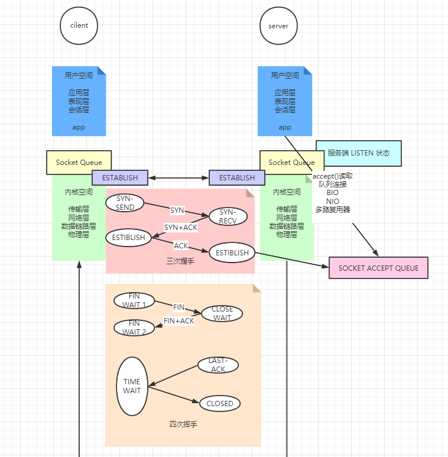

# 网络&IO面试题

## 1.TCP三次握手

## 2.TCP四次挥手

## 3.TCP连接状态

## 4.Connection refused

backlog 满了，accept队列满了

## 5.OSI七层参考模型

## 6.什么是长连接和短连接，有状态/无状态

tcp 只是连接，

http 1.0 的时候，都是短连接

http 1.1 的时候默认请求头加上keep-alive 此时就是长连接，

长连接指的是复用连接，即一个连接可以请求-响应多次

http 请求是无状态的，指的是两个页面之间，并没有联系

## 7.IO模型

0: IO是程序对着内核socket-queue的包装

BIO：读取，一直等queue里有才返回，阻塞模型，每连接对应一个线程

NIO：读取，理科返回：读到，没读到，程序逻辑要自己维护

多路复用：内核增加select，poll，epoll 新增的和数据接收，连接接收实质无关的调用，得到是对应socket的事件(listen socket,socket)，可以有效地去再次accept，R/W

## 8.同步阻塞，同步非阻塞

BIO，NIO，多路复用器，在IO模型上都是同步的，都是程序自己accept，R/W

## 9.沾包，拆包

有程序，有内核，程序和内核协调工作

有一些是内核做的事情，三次握手，数据发送出去，接收进来，内核，TCP，分包。到我们自己的程序，即便在一个socket里，也可能收到多个消息在一个字节数组中，我们要自己进行拆解

 