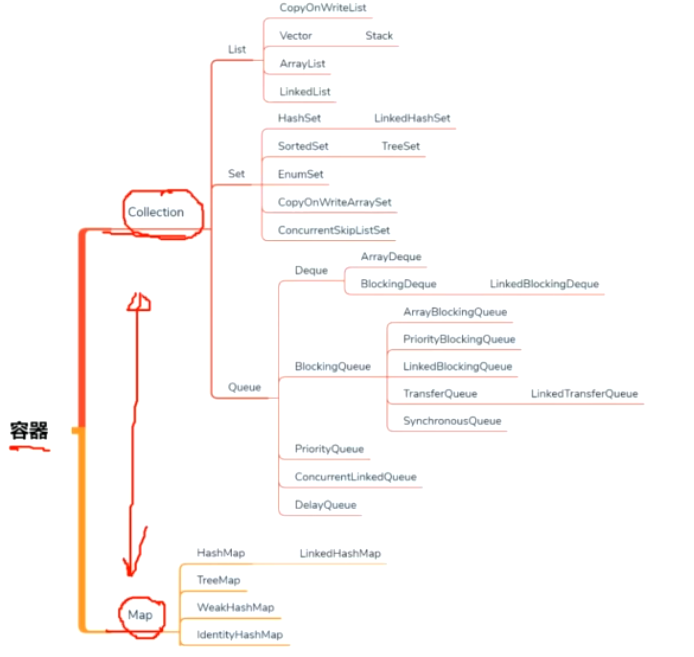

# 线程安全集合容器

## Vector、Hashtable

-线程安全，加了锁

## Collections 工具栏

Collections.synchronizedMap（hashMap）;

将hashMap 加锁，但是效率比较低

## ConcurrentHashMap

插入效率较低，读效率较高

底层CAS

## ConcurrentSkipListMap

排序的线程安全的Map

## CopyOnWriteList

写时加锁，复制

读时，不加锁，因为读的是复制后的数据，

适用于，读多写少的情况下。

## Queue

offer 添加，返回是否成功

add 超出数量报异常

peek

poll

size

## LinkedBlockingQueue

BlockingQueue 阻塞队列

阻塞方法

put 添加，如果满了会阻塞

take 取，如果为空会阻塞

## ArrayBlockingQueue

有界的，BlockingQueue

## PriorityQueue

优先级阻塞队列，内部是一个二叉树，最小堆

## DelayQueue

延迟阻塞队列，按照对象设置的时间排序

作用：按时间进行任务调度

## SynchronusQueue

容量为0，用来让一个线程给另一个线程下达任务的

只有能使用阻塞方法来进行take 和 put ,并且只有take在put之前才可以take到。

## TransferQueue

LinkedTransferQueue

transfer（e）;

装进容器里，此线程就阻塞了。等待消费者消费了就放行了