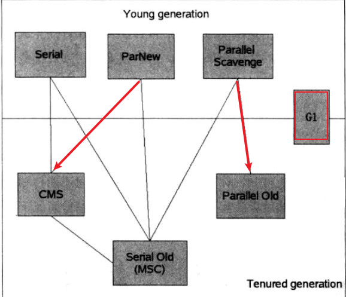

# JVM 面试 

1. 描述JVM内存模型

   - 线程共享：本地方法栈，虚拟机栈，程序计数器
   - 线程独享：堆，方法区

2. 回收算法

   

3. 解决线上GC频繁的问题

4. 描述class初始化的过程

   1. load
   2. linking(verification,paraparetion,resolution)
   3. initial

5. 描述内存溢出的原因，如何排查

6. 有哪些垃圾回收器？如何选择？

7. 描述Java类加载模型(加载和初始化的过程？)

8. 垃圾回收器G1

9. Happens-Before

10. 什么叫做阻塞队列的有界和无界，实际中有用过吗？

11. 内存屏障的汇编指令

